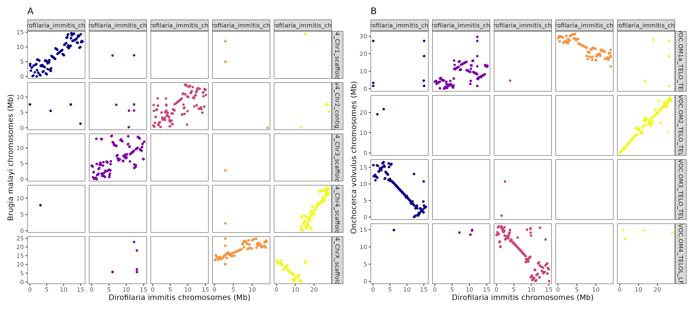

# Dirofilaria immitis populaiton genomics: 
## Comparative Genomics

### stephen doyle


## Comparsions of Di to Bm and Ov
### Dotplots

```bash
cd /nfs/users/nfs_s/sd21/lustre_link/dirofilaria_immitis/COMPARATIVE_GENOMICS

grep ">" brugia_malayi.PRJNA10729.WBPS17.genomic.fa | grep "Chr" | sed 's/>//'g | while read -r NAME; do 
    samtools faidx brugia_malayi.PRJNA10729.WBPS17.genomic.fa ${NAME} >> bm_chr.fa; 
    done

ln -s /nfs/users/nfs_s/sd21/lustre_link/REFERENCE_SEQUENCES/onchocerca_volvulus/ONCHO_V4.ref.fa

>ov_chr.fa
grep ">" ONCHO_V4.ref.fa | grep "OVOC.OM" | sed 's/>//'g | while read -r NAME; do 
    samtools faidx ONCHO_V4.ref.fa ${NAME} >> ov_chr.fa; 
    done


>di_chr.fa
grep ">" dimmitis_WSI_2.0.fa | grep "chr" | sed 's/>//g' | while read -r NAME; do 
    samtools faidx dimmitis_WSI_2.0.fa ${NAME} >> di_chr.fa; 
    done

# map Di to Bm
minimap2 -x asm20 di_chr.fa bm_chr.fa  > di_v_bm.paf

# map Di to Ov
minimap2 -x asm20 di_chr.fa ov_chr.fa  > di_v_ov.paf

# clean up the paf file for plotting
for i in *.paf; do
cat ${i}| /nfs/users/nfs_s/sd21/lustre_link/software/GENOME_ASSEMBLY/minimap/utils/bin/layout | cut -f1-19 > ${i%.paf}.layout;
done


```


```R
library(tidyverse)
library(viridis)
library(patchwork)


data<-read.table("di_v_bm.layout")
data<-data[data$V17 > 300, ]
tdata<-data[data$V17 > 300,  ]
vdata<-aggregate(data$V5, by=list(data$V4), max)

plot_di_v_bm <- 
    ggplot() +
    geom_segment(data=data,mapping=aes(y=V10/1e6, yend=V11/1e6, x=V15/1e6, xend=V16/1e6, colour=V4)) +
    theme_bw() + theme(panel.grid.major = element_blank(), panel.grid.minor = element_blank(), legend.position = "none") +
    geom_point(data=tdata, aes(x=V15/1e6, y=V10/1e6, colour=V4), size=1) +
    geom_point(data=tdata, aes(x=V16/1e6, y=V11/1e6, colour=V4), size=1) +
    labs(title = "A", y="Brugia malayi chromosomes (Mb)", x="Dirofilaria immitis chromosomes (Mb)", colour="Chromosome") +
    scale_colour_viridis(discrete = TRUE, option="plasma") + facet_grid(V1~V4, scales="free")


data<-read.table("di_v_ov.layout")
data<-data[data$V17 > 300, ]
tdata<-data[data$V17 > 300,  ]
vdata<-aggregate(data$V5, by=list(data$V4), max)

plot_di_v_ov <- 
    ggplot()+
    geom_segment(data=data,mapping=aes(y=V10/1e6, yend=V11/1e6, x=V15/1e6, xend=V16/1e6, colour=V4)) +
    theme_bw()+theme(panel.grid.major = element_blank(), panel.grid.minor = element_blank(), legend.position = "none")+
    geom_point(data=tdata, aes(x=V15/1e6, y=V10/1e6, colour=V4), size=1)+
    geom_point(data=tdata, aes(x=V16/1e6, y=V11/1e6, colour=V4), size=1)+
    labs(title = "B", y="Onchocerca volvulus chromosomes (Mb)", x="Dirofilaria immitis chromosomes (Mb)", colour="Chromosome")+
    scale_colour_viridis(discrete = TRUE, option="plasma") + facet_grid(V1~V4, scales="free")

plot_di_v_bm + plot_di_v_ov + plot_layout(ncol=1)


ggsave("chromosomes.dotplot.pdf", height=15, width=7, units="in")

```



## Circos plot comparing Di and Bm
```bash 
samtools faidx di_chr.fa
samtools faidx bm_chr.fa
samtools faidx ov_chr.fa

cat di_chr.fa.fai bm_chr.fa.fai | awk '{print $1, "1", $2}' OFS="\t" > di_bm_chromosome_lengths.txt
cat di_chr.fa.fai ov_chr.fa.fai | awk '{print $1, "1", $2}' OFS="\t" > di_ov_chromosome_lengths.txt


```

### Di vs Bm
- plot
https://jokergoo.github.io/circlize_book/book/initialize-genomic-plot.html
- links
https://jokergoo.github.io/circlize_book/book/genomic-plotting-region.html#genomic-links
```R
library(tidyverse)
library(circlize)
library(viridis)

chr <- read.table("di_bm_chromosome_lengths.txt", header=F)
colnames(chr) <- c("chr", "start", "end")
data<-read.table("di_v_bm.layout")
data<-data %>% filter(V18>5000)

bm_links <- data %>% select(V8, V10, V11, V18)
colnames(bm_links) <- c("chr", "start", "end", "value")
di_links <- data %>% select(V13, V15, V16, V18)
colnames(di_links) <- c("chr", "start", "end", "value")


colours <- plasma(5, direction=1)

palette(colours)

grid.col = c(dirofilaria_immitis_chrX = "#F0F921FF", dirofilaria_immitis_chr4 = "#F89441FF", dirofilaria_immitis_chr3 = "#CC4678FF", dirofilaria_immitis_chr2 = "#7E03A8FF", dirofilaria_immitis_chr1 = "#0D0887FF",   
    Bm_v4_Chr1_scaffold_001 = "grey", Bm_v4_Chr2_contig_001 = "grey", Bm_v4_Chr3_scaffold_001 = "grey", Bm_v4_Chr4_scaffold_001 = "grey", Bm_v4_ChrX_scaffold_001 = "grey")


pdf("di_bm_circulize.pdf")
circos.clear()

circos.genomicInitialize(chr)
circos.track(ylim = c(0, 1), bg.col = grid.col, bg.border = NA, track.height = 0.075)
circos.genomicLink( bm_links,di_links, border = NA,  col = as.factor(di_links$chr))

circos.clear()
dev.off()
```


### Di vs Ov
```R
library(tidyverse)
library(circlize)
library(viridis)

chr <- read.table("di_ov_chromosome_lengths.txt", header=F)
colnames(chr) <- c("chr", "start", "end")
data<-read.table("di_v_ov.layout")
data<-data %>% filter(V18>5000)

ov_links <- data %>% select(V8, V10, V11, V18)
colnames(ov_links) <- c("chr", "start", "end", "value")
di_links <- data %>% select(V13, V15, V16, V18)
colnames(di_links) <- c("chr", "start", "end", "value")


grid.col = c(dirofilaria_immitis_chrX = "#F0F921FF", dirofilaria_immitis_chr4 = "#F89441FF", dirofilaria_immitis_chr3 = "#CC4678FF", dirofilaria_immitis_chr2 = "#7E03A8FF", dirofilaria_immitis_chr1 = "#0D0887FF",   
    OVOC.OM1a_TELO_TELO = "grey", OVOC.OM2_TELO_TELO = "grey", OVOC.OM3_TELO_TELO = "grey", OVOC.OM4_TELOL_LFR = "grey")


pdf("di_ov_circulize.pdf")
circos.clear()

circos.genomicInitialize(chr)
circos.track(ylim = c(0, 1), bg.col = grid.col, bg.border = NA, track.height = 0.075)
circos.genomicLink(ov_links,di_links, border = NA,  col = as.factor(di_links$chr))

circos.clear()
dev.off()
```


### COmparison on new Di chromosomes and ICBAS_JMDir_1.0 assembly
```bash 
minimap2 -x asm20 di_chr.fa ../REFERENCE_GENOMES/GCA_024305405.1_ICBAS_JMDir_1.0_genomic.fa > di_chr.v.ICBAS_JMDir_1.0.paf

cat di_chr.v.ICBAS_JMDir_1.0.paf | /nfs/users/nfs_s/sd21/lustre_link/software/GENOME_ASSEMBLY/minimap/utils/bin/layout > di_chr.v.ICBAS_JMDir_1.0.layout
cat di_chr.v.ICBAS_JMDir_1.0.layout | cut -f1-19 > di_chr.v.ICBAS_JMDir_1.0.layout2

samtools faidx di_chr.fa
samtools faidx ../REFERENCE_GENOMES/GCA_024305405.1_ICBAS_JMDir_1.0_genomic.fa

cat di_chr.fa.fai ../REFERENCE_GENOMES/GCA_024305405.1_ICBAS_JMDir_1.0_genomic.fa.fai | awk '{print $1, "1", $2}' OFS="\t" > chromosome_lengths.txt

```


## Mapping nanopore to genome to check X chromosome coverage
- coverage breaks from low to high between 12790000 and 12800000 - likely boundary of the PAR

```bash
bsub.py 10 nanopore_to_di "minimap2 -a -x map-ont dimmitis_WSI_1.0.fa ../GENOME_IMPROVEMENT/NANOPORE_DATA/SRR14299255_1.fastq.gz  \| samtools view -h -b \| samtools sort -o nanopore_to_di.bam"

samtools index nanopore_to_di.bam


```


## Telomeres
```bash
fastaq search_for_seq dimmitis_WSI_1.0.fa telomere_dimer.pos ttaggcttaggc

cat telomere_dimer.pos | awk '{print $1,$2,$2+1}' OFS="\t" > telomere_dimer.bed

bedtools makewindows -g ${REF_DIR}/REF.genome -w 10000 > genome.10000bp.bed

bedtools coverage -b telomere_dimer.bed -a REF.genome.10000bp.bed  | awk '{print $1, $2, $3, $5}' OFS="\t" | bedtools sort > telomere_coverage.bedgraph
```


## Coverage
```bash
cd ~/lustre_link/dirofilaria_immitis/POPGEN/MAPPING_dirofilaria_immitis_popgen

# generate coverage data, including in 50kb windows
bsub.py 10 cov_stats ~sd21/bash_scripts/run_cov_stats 50000

```
- where "run_cov_stats" is: 

```bash
##########################################################################################
# run_cov_stats
##########################################################################################

# Usage: ~sd21/bash_scripts/run_cov_stats < window size >

module load bamtools/2.5.1--he860b03_5

WINDOW=$1

for i in *.bam
do

bamtools header -in ${i} | grep "^@SQ" | awk -F'[:\t]' '{printf $3"\t"1"\t"$5"\n"}' OFS="\t" > ${i%.bam}.chr.bed
bamtools header -in ${i} | grep "^@SQ" | awk -F'[:\t]' '{printf $3"\t"$5"\n"}' OFS="\t" > ${i%.bam}.chr.genome

bedtools makewindows -g ${i%.bam}.chr.genome -w ${WINDOW} > ${i%.bam}.${WINDOW}_window.bed

samtools bedcov -Q 20 ${i%.bam}.chr.bed ${i} | awk -F'\t' '{printf $1"\t"$2"\t"$3"\t"$4"\t"$4/($3-$2)"\n"}' OFS="\t" > ${i%.bam}.chr.cov
samtools bedcov -Q 20 ${i%.bam}.${WINDOW}_window.bed ${i} | awk -F'\t' '{printf $1"\t"$2"\t"$3"\t"$4"\t"$4/($3-$2)"\n"}' OFS="\t" > ${i%.bam}.${WINDOW}_window.cov

rm ${i%.bam}.chr.bed ${i%.bam}.${WINDOW}_window.bed ${i%.bam}.chr.genome

done

for i in *.chr.cov; do printf "${i}\n" > ${i}.tmp | awk '{print $5}' OFS="\t" ${i} >> ${i}.tmp; done
paste *.tmp > coverage_stats.summary
rm *.tmp

```

### 
```bash

for i in *.merged.50000_window.cov; do
name=$(echo ${i%.merged.50000_window.cov})
stage=$(echo ${i%.merged.50000_window.cov} | cut -f3 -d "_")
cat ${i} | grep "chr" | grep -v "chrM\|chrW" | awk -v name=$name -v stage=$stage '$1 ~ "dirofilaria_immitis_chrX" && $2 >= "12000000" {next} {print name,stage,$0}' OFS="\t" ; 
done > curated.coverage_data.txt

```

### ratio of X to autosome coverage

```R
# load libraries
library(tidyverse)
library(viridis)
library(patchwork)

cov_data <- read.table("curated.coverage_data.txt")

data <- cov_data %>% group_by(V1,V2) %>% mutate(median_cov=V7/median(V7))
data2 <- data %>% group_by(V1,V2,V3) %>% summarise(mean=mean(median_cov))

data3 <- spread(data2, key=V3, value=mean)

ggplot(data3) + geom_point(aes(dirofilaria_immitis_chr1,dirofilaria_immitis_chrX, col=V2))


plot_sample_cov_ratio <- 
    ggplot(data3) +
    geom_point(aes(x=reorder(V1,-((dirofilaria_immitis_chrX/((dirofilaria_immitis_chr1+dirofilaria_immitis_chr2+dirofilaria_immitis_chr4+dirofilaria_immitis_chr4)/4)))),y=(dirofilaria_immitis_chrX/((dirofilaria_immitis_chr1+dirofilaria_immitis_chr2+dirofilaria_immitis_chr4+dirofilaria_immitis_chr4)/4)), col=V2),size=1) + 
    ylim(0.35,1.15) + 
    labs(y="Normalised coverage", x="Samples", colour="Lifestage") + 
    theme_bw() + theme(axis.title.x=element_blank(),
        axis.text.x=element_blank(),
        axis.ticks.x=element_blank()) +
    scale_colour_viridis_d()


# male vs female coverage plots 
male_data <- read.table("AUS_NSW_ADM_004.merged.50000_window.cov", sep="\t")
male_data$sex <- "male"
male_data <- male_data %>% mutate(normalised = V5/median(V5))

female_data <- read.table("USA_GEO_ADF_001.merged.50000_window.cov", sep="\t")
female_data$sex <- "female"
female_data <- female_data %>% mutate(normalised = V5/median(V5))

data <- bind_rows(male_data, female_data)

data <- data %>% filter(str_detect(V1, 'chr')) %>% filter(!str_detect(V1, 'chrM|chrW'))

plot_male_female_cov <-
    ggplot(data) + 
    geom_point(aes(V2/1e6,normalised,col=V1), show.legend = FALSE, size=0.5) + 
    facet_grid(sex~V1, scales="free_x") + 
    ylim(0,2) + 
    scale_colour_viridis_d(option="plasma") + 
    theme_bw() +
    labs(y="Normalised coverage", x="Genomic position (Mb)")


plot_male_female_cov + plot_sample_cov_ratio + plot_layout(ncol=2, widths = c(5,1.5))

ggsave("coverage_plots.pdf", height=3, width=10 )
```


## Cumulative genome size plots
- want to compare the three Dirofilara genomes

```bash 
cd /nfs/users/nfs_s/sd21/lustre_link/dirofilaria_immitis/COMPARATIVE_GENOMICS/CUMULATIVE_GENOME

cp ../../dimmitis_WSI_2.2.fa .
cp ../../REFERENCE_GENOMES/GCA_024305405.1_ICBAS_JMDir_1.0_genomic.fa ICBAS_JMDir_1.0.fa
cp ../../REFERENCE_GENOMES/dirofilaria_immitis.PRJEB1797.WBPS17.genomic.fa nDi.2.2.fa

# make an index file to get data from
for i in *fa; do
    samtools faidx ${i};
    done


for i in *fai; do
    name=$(echo ${i%.fa.fai})
    cat ${i} | sort -k2nr | awk -v name=${name} '{print name,$1,$2,total += $2; $0 = total}' OFS="\t";
done > cumulative_genomes_data.txt
```

```R
# libraries
library(tidyverse)

data1 <- read.table("cumulative_genomes_data.txt", sep="\t", header=F)
data2 <- data1 %>% group_by(V1) %>% summarise(V3 = as.numeric(max(V3))) %>% mutate(V2="start") %>% mutate(V4=1) %>% relocate(V1,V2,V3,V4)
data <- bind_rows(data1,data2)

ggplot(data) + 
    geom_point(aes(V4/1e6,V3/1e6,col=V1),size=2) + 
    geom_line(aes(V4/1e6,V3/1e6,col=V1),size=1) +
    theme_bw() +
    labs(x="Cumulative genome size (Mb)", y= "Scaffold/contig length (Mb)", colour="Genome assembly")

ggsave("cumulative_genome_comparison.pdf", height=5, width=6, units="in")
ggsave("cumulative_genome_comparison.png")
```
